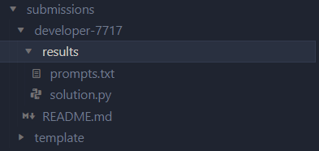
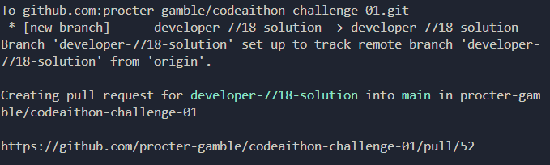
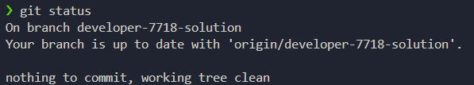

# Task 28 - Project Repository

This repository provides the structure necessary to approve your assignment. Please refer to the contents of this file for all necessary information.

Link to task description on the: [Task 28 - Find a bug in the code ](docs/instructions.md)

Link to the event description (Hackathon) on [Confluence](https://pgone.sharepoint.com/sites/AIECode-AI-Thon)

# Prerequisites

### Important Notice

Do not delete any directories/files created after cloning the repository. Removing these files will result in your task solution not being validated.

Ensure that you have Python 3.10 or higher installed on your system. You can verify your Python version by running the following command in your terminal:

```bash
python --version
```

If Python is not installed, download and install it from the official Python website.

## Cloning the Repository

To get started with the task, you first need to clone the repository to your local machine. Use the following command:

```bash
git clone https://github.com/procter-gamble/codeaithon-challenge-28.git
```

### Repository Structure

The repository is structured as follows to maintain an organized and standardized environment:

```
.
├── 📂 codeaithon-challenge-01            <- Main repository folder.
│   ├── 📂 .github                       <- This directory contains YAML, .py and requirements files for Continuous Integration and Continuous Deployment (CI/CD).
│   ├── 📂 data                          <- The place where the data files are stored (if required)
│   ├── 📂 docs                          <- Instructions, guidelines, resources markdown files.
│   ├── 📂 src
|        └── 📂 bash                     <- A place where the setup script is located
│   │    └── requirements.txt             <- Python packages required for local development
│   ├── 📂 submissions
|        └── 📂 template                 <- A template which is used to create a directory for posting the solution to the task
│   ├── 📂 tests                         <- Tests to verify the correctness of the task - do not post tests you have written here
│   ├── .gitignore                        <- .gitignore file
│   ├── README.md                         <- This document
│   └── sonar-project.properties          <- This file is used by SonarQube to manage the code quality checks.
```

## Setup Script

Before you start working on the project, run the setup script to prepare your development environment. This script organizes the necessary files into the appropriate directories based on your developer ID. The script also organises the work in the GIT repository.

### Preparing the Setup Script

To ensure the script can be executed, you need to grant it executable permissions. Navigate to the script's directory and run the following command:

```bash
chmod +x src/bash/./create_submission_folder.sh
```

### Running the Setup Script

From the main folder of the project, execute the setup script by running:

```bash
./src/bash/create_submission_folder.sh <your_developer_id>
```

Replace `<your_developer_id>` with your unique developer ID. This script creates a new folder within the `submissions` directory where you should place your solution to the task:



This script will also create a new branch, agreeing with the following format:

developer-`<your_developer_id>`-solution

And will also create a Pull Request visible in GitHub (example for task 01):



Once the script is executed, you can make sure you are on the right branch by executing the command:

```bash
git status
```



IMPORTANT: Do not create a new branch with the task solution, add your code and new commits to the branch created by the script.

### Post-Script Structure

After running the setup script, the following structure will be created in the `submissions` folder:

```
.
├── 📂 developer-<your_developer_id>             <- This folder is your designated workspace.
│   ├── 📂 results                               <- Folder for storing all files related to your solution
│        └── solution.py                          <- File for storing the solution to the task.
|        └── test_solution.py                     <- File for storing the tests for the solution to the task.
│        └── prompts.txt                          <- A place to enter the prompts you used to work with Copilot
│   ├── README.md                                <- This file contains instructions on how to run the code you have created (to be completed by you).
```

### solution.py file

The file `solution.py` is where you should place the code that constitutes your solution to the task. If you need to use more than one file you have this option. Please note, however, that all solution files should be placed in the `results` folder inside the folder for your dedicated developer-id.

### test_solution.py file

The file `test_solution.py` is the place where you should put the code that constitutes the tests for your solution to the task. If you need to use more than one file you have this option. Please note, however, that all files that constitute tests for a task should be placed in the `results` folder inside the folder for your dedicated developer-id. Please also note that the test files should start with the prefix `test_`.

### prompts.txt file

You can work with CodePg in a variety of ways. We assume that you will not only use the autocompletion offered by CodePG, but also the possibilities offered by the chat window. Your creativity and innovation in this area will also be evaluated!

If you have used the chat option, save the prompts you have created in a `prompts.txt` file within the `results` folder.

Details on how the prompts will be graded can be found at [this link](https://pgone.sharepoint.com/sites/AIECode-AI-Thon/SitePages/Competition-Categories.aspx)

## Setting Up the Environment

To avoid conflicts with other Python projects or system-wide packages, it's recommended to use a virtual environment. Here's how to set it up:

## Creating a Virtual Environment

Navigate to the project's root directory and run the following command to create a virtual environment:

```bash
python -m venv env
```

This command creates a new directory env in your project directory, containing the virtual environment.

## Activating the Virtual Environment

Before working on the project, you need to activate the virtual environment. Depending on your operating system, run one of the following commands:

On Windows:

```bash
env\Scripts\activate
```

On macOS and Linux:

```bash
source env/bin/activate
```

## Installing Dependencies

The task dependencies are listed in a file named requirements.txt located in the 'code' folder. To install these dependencies, make sure your virtual environment is activated, and run:

```bash
pip install -r src/requirements.txt
```

# Working on a solution for a task

## Making Changes and Committing

After making your changes, you can see them by running:

```bash
git status
```

Add your changes to the branch you created:

```bash
git add .
```

Then commit your changes:

```bash
git commit -m "A descriptive message about your changes"
```

## Pushing Changes

To push your new branch to the remote repository, use:

```bash
git push origin <branch_name>
```

## Submitting a solution

Remember that executing the `create_submission_folder.sh` script described earlier will create a new branch and Pull Request in GitHub. Therefore, work on the task consists of committing to the branch created by the script. There is no formal form for completing the task - simply add it to the branch when you feel your last commit is complete.

### Important Notice

The pull request created for your branch should still be in open status.
